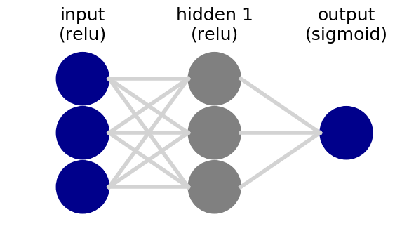
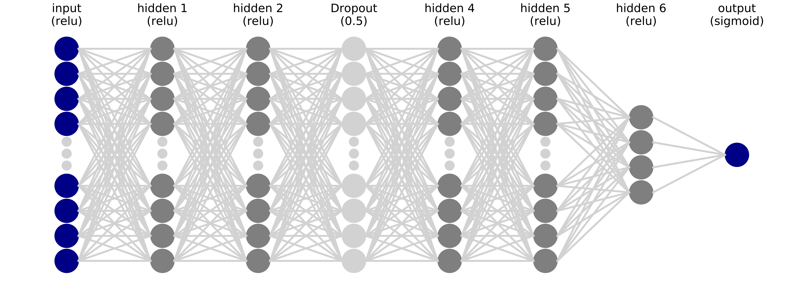

# Neural Network Visualizer (NNV)

Simple and easy to use tool to generate Neural Network Visualizations.


# Installation
```
pip install nnv
```

# Usage

```python
from nnv import NNV

layersList = [
    {"title":"input\n(relu)", "units": 3, "color": "darkBlue"},
    {"title":"hidden 1\n(relu)", "units": 3},
    {"title":"hidden 2\n(relu)", "units": 3, "edges_color":"red", "edges_width":2},
    {"title":"output\n(sigmoid)", "units": 1,"color": "darkBlue"},
]

NNV(layersList).render()
```




It is possible to customize the node size/colors, title font size, spacing between nodes and layers and maximum number of nodes to show,...


```python
from nnv import NNV

# Let's increase the size of the plot
import matplotlib.pyplot as plt
plt.rcParams["figure.figsize"] = (200,10)


layers_list = [
    {"title":"input\n(relu)", "units": 300, "color": "darkBlue"},
    {"title":"hidden 1\n(relu)", "units": 150},
    {"title":"hidden 2\n(relu)",  "units": 75},
    {"title":"Dropout\n(0.5)", "units": 75, "color":"lightGray"},
    {"title":"hidden 4\n(relu)",  "units": 18},
    {"title":"hidden 5\n(relu)",  "units": 9},
    {"title":"hidden 6\n(relu)",  "units": 4},
    {"title":"output\n(sigmoid)", "units": 1, "color": "darkBlue"},
]


NNV(layers_list, max_num_nodes_visible=8, node_radius=10, spacing_layer=60, font_size=24).render(save_to_file="my_example_2.pdf")
```



# Documentation

NNV documentation is still being created. For now, if you have any question, please look directly the library source code or open an Issue.

# Future addittions

Some useful features that may be added in the future (help is welcome):
- add labels to each node
- import layers info directly from a keras model

# Citation
If you use this library and would like to cite it, you can use:
```
 R. Cordeiro, "NNV: Neural Network Visualizer", 2019. [Online]. Available: https://github.com/renatosc/nnv. [Accessed: DD- Month- 20YY].
```

or:

```
@Misc{,
  author = {Renato Cordeiro},
  title  = {NNV: Neural Network Visualizer},
  month  = may,
  year   = {2019},
  note   = {Online; accessed <today>},
  url    = {https://github.com/renatosc/nnv},
}
```


